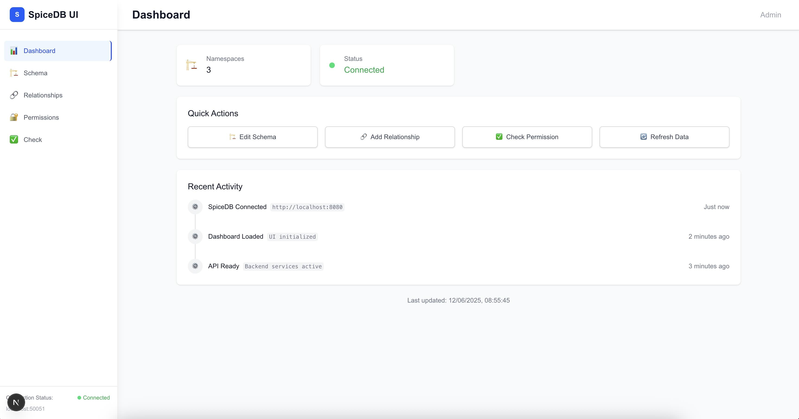
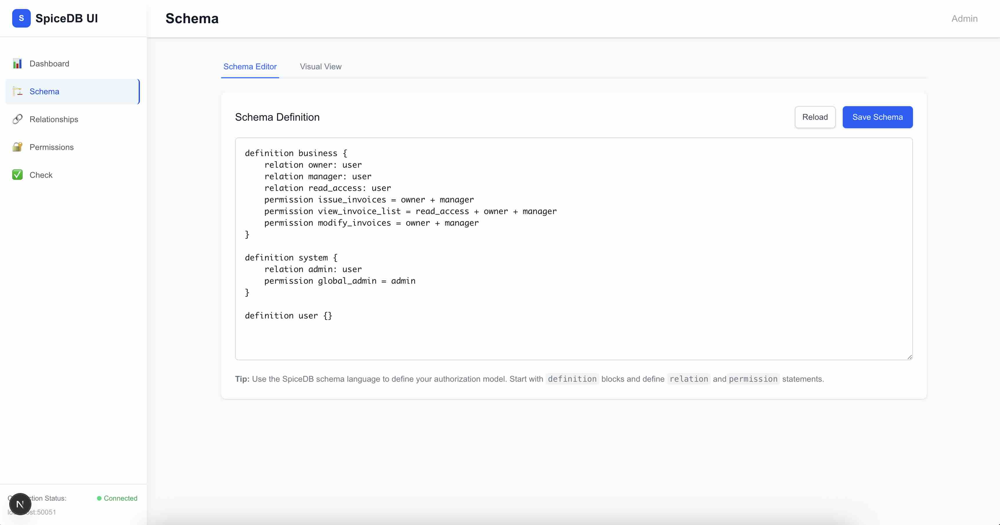
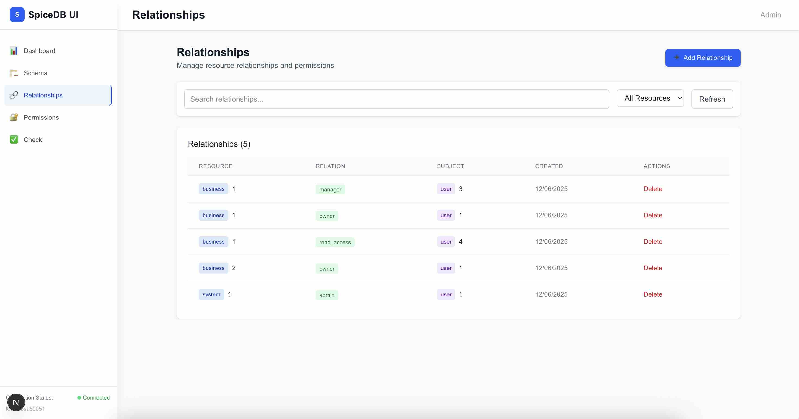
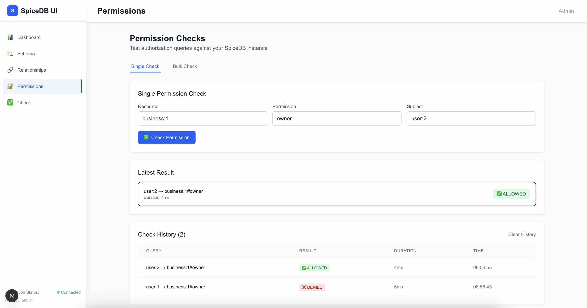
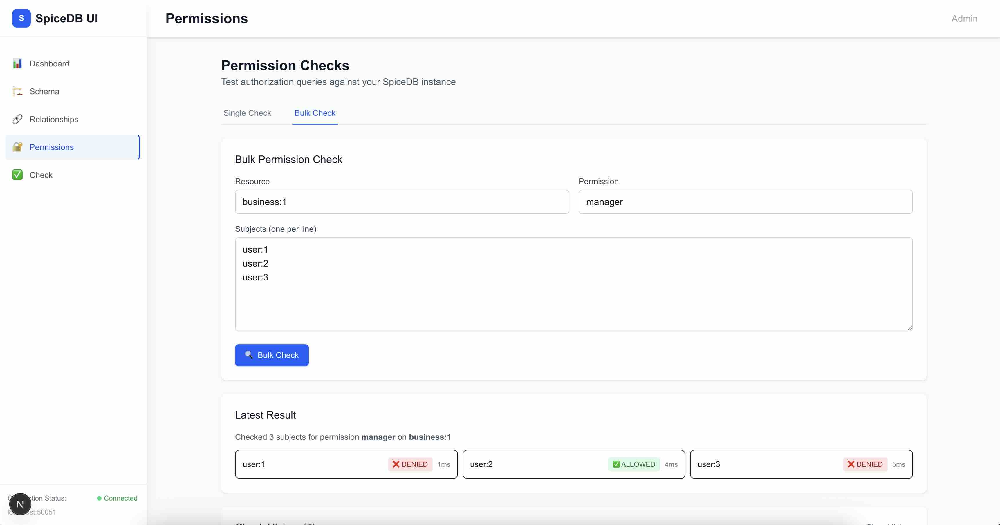
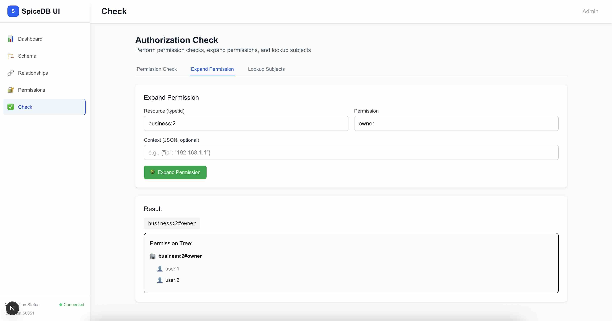

# SpiceDB UI

A modern web interface for managing SpiceDB authorization systems. Built with Next.js and Tailwind CSS.

<p align="center">
  
  
  
  
  
  
</p>

## Features

- **Dashboard** - Real-time overview of your SpiceDB instance with stats and activity
- **Schema Management** - Visual and text-based schema editor with validation
- **Relationship Management** - CRUD operations with smart dropdowns and search
- **Authorization Testing** - Permission checks, expansions, and subject lookups

## Prerequisites

- Node.js 16+
- Running SpiceDB instance (HTTP API enabled)

## Quick Start

1. **Clone and install**
   ```bash
   git clone https://github.com/mejaz/spicedb-ui.git
   cd spicedb-ui
   npm install
   ```

2. **Start SpiceDB with HTTP API**
   ```bash
   docker run -d --rm -p 50051:50051 -p 8080:8080 \
     authzed/spicedb serve \
     --grpc-preshared-key "your-token-here" \
     --http-enabled
   ```

3. **Configure environment**
   ```bash
   # Create .env.local
   SPICEDB_URL=http://localhost:8080
   SPICEDB_TOKEN=your-token-here
   ```

4. **Start the UI**
   ```bash
   npm run dev
   ```

   Open [http://localhost:3000](http://localhost:3000)

## Configuration

Environment variables in `.env.local`:

```bash
SPICEDB_URL=http://localhost:8080    # SpiceDB HTTP API endpoint
SPICEDB_TOKEN=your-token-here        # Pre-shared key for authentication
```

## Usage

### 1. Schema Management
- Navigate to **Schema** page
- Edit your authorization model using SpiceDB schema language
- Use the visual view to see parsed namespaces, relations, and permissions
- Save changes directly to SpiceDB

### 2. Relationship Management
- Go to **Relationships** page
- Add relationships using smart dropdowns:
    - **Resource**: Search existing or create new (e.g., `business:acme-corp`)
    - **Relation**: Auto-populated from your schema (e.g., `owner`, `manager`)
    - **Subject**: Manual entry (e.g., `user:alice`)
- View, search, and filter existing relationships

### 3. Authorization Testing
- Use **Check** page for permission testing:
    - **Permission Check**: Test if a subject has permission on a resource
    - **Expand Permission**: Visualize permission trees
    - **Lookup Subjects**: Find all subjects with a specific permission


## Example Schema

```javascript
definition user {}

definition business {
  relation owner: user
  relation manager: user
  relation read_access: user
  
  permission issue_invoices = owner + manager
  permission view_invoice_list = read_access + owner + manager
  permission modify_invoices = owner + manager
}

definition system {
  relation admin: user
  permission global_admin = admin
}
```

## API Endpoints

The UI creates several API routes:

- `GET /api/spicedb/stats` - Dashboard statistics
- `GET /api/spicedb/health` - Connection health check
- `GET /api/spicedb/activity` - Recent activity feed
- `GET /api/spicedb/resources` - Available resources and relations
- `GET|POST /api/spicedb/schema` - Schema management
- `GET|POST|DELETE /api/spicedb/relationships` - Relationship CRUD
- `POST /api/spicedb/check` - Permission checking
- `POST /api/spicedb/expand` - Permission expansion
- `POST /api/spicedb/lookup-subjects` - Subject lookup

## Tech Stack

- **Frontend**: Next.js 13+, React, Tailwind CSS
- **Backend**: Next.js API routes
- **Database**: SpiceDB (via HTTP API)
- **Styling**: Tailwind CSS with custom components

## Development

```bash
npm run dev      # Start development server
npm run build    # Build for production
npm start        # Start production server
```

## Contributing

1. Fork the repository
2. Create a feature branch
3. Make your changes
4. Test with your local SpiceDB instance
5. Submit a pull request

## License

MIT

## Links

- [SpiceDB Documentation](https://authzed.com/docs)
- [SpiceDB GitHub](https://github.com/authzed/spicedb)
- [Next.js Documentation](https://nextjs.org/docs)